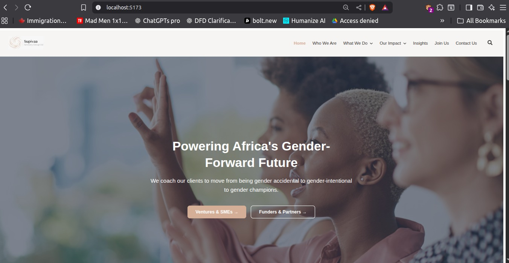
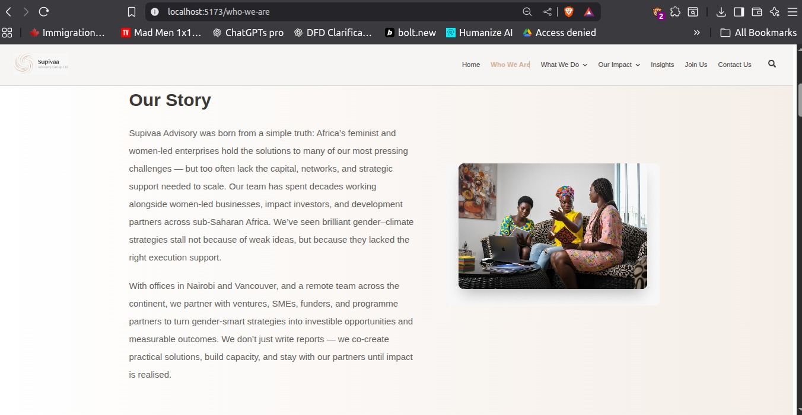
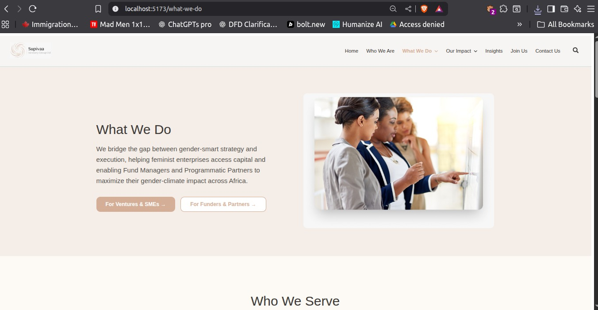
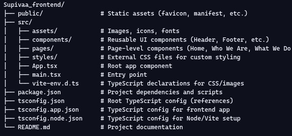

# Supivaa Frontend

Supivaa’s frontend is a modern, responsive marketing site built with **React + TypeScript**.  
It is styled using a combination of **TailwindCSS** (utility‑first styling) and **external CSS files** for fine‑grained control over layout, typography, and component polish.  

The frontend integrates seamlessly with backend APIs (Laravel/PHP) to deliver scalable, secure, and maintainable content management.  
This architecture ensures design fidelity, responsive performance across devices, and robust admin controls for content updates.


##  Features

- **Responsive Design**  
  Fully optimized for desktop, tablet, and mobile using progressive media queries.  
  Combines **TailwindCSS utilities** with **external CSS files** for precise layout control and pixel‑perfect polish.

- **Modern Tech Stack**  
  - React + TypeScript for robust, type‑safe components  
  - Vite for fast builds and hot‑reload development  
  - TailwindCSS for utility‑first styling  
  - External CSS for custom overrides and fine‑grained styling  
  - Filament/Livewire integration for admin panel (via backend)

- **Reusable Components**  
  Clean, modular structure for sections like Header, Footer, About, Values, Team, Partners, etc.

- **Accessibility & Performance**  
  Semantic HTML, ARIA attributes, lazy‑loaded images, optimized CSS for fast rendering.

- **Animations & Interactivity**  
  Subtle hover effects, scroll‑in animations, and interactive carousels.

##  Screenshots

Visual previews of Supivaa’s frontend across different pages and devices.  
Screenshots demonstrate both **TailwindCSS utility styling** and **external CSS overrides** for polished layouts.

### Home Page


### Who We Are


### What We Do



## 📂 Project Structure

The Supivaa frontend follows a clean, modular structure that combines **React + TypeScript** components with **TailwindCSS utilities** and **external CSS files** for fine‑grained styling.

### 🖼️ Visual Representation


      
##  Performance Highlights

Supivaa’s frontend is optimized for speed, scalability, and accessibility.  
By combining **TailwindCSS utilities** with **external CSS styling**, the site achieves both rapid builds and pixel‑perfect polish.

- ** Vite Bundling**  
  Lightning‑fast dev server and optimized production builds.

- ** Code Splitting**  
  Only loads what’s needed per route, improving performance and reducing bundle size.

- ** Image Optimization**  
  Responsive image sizes, `object-fit` usage, and lazy loading for faster page rendering.

- ** CSS Optimization**  
  Tailwind purge removes unused styles, while external CSS ensures fine‑grained control.

- ** Accessibility Checks**  
  Keyboard navigation, ARIA attributes, and screen reader support built into components.

- ** Smooth Interactivity**  
  Subtle hover effects, scroll‑in animations, and responsive dropdown menus for engaging UX.


 ##  Getting Started

Follow these steps to set up Supivaa’s frontend locally.  
The project uses **React + TypeScript**, styled with **TailwindCSS** and **external CSS files** for custom overrides.

### Prerequisites
- Node.js (>= 18.x recommended)
- npm or yarn
- Git

### Installation
Clone the repository and install dependencies:

     ```bash
     ```

git clone https://github.com/Alex-gikungu/Supivaa_frontend.git
cd Supivaa_frontend
npm install

     
 
 ##  Development & Build

### Development
Run the local dev server:

     npm run dev
     
   

### Build
Generate a production build:

     ```bash
     npm run build
     ```
    

##  Deployment

Supivaa’s frontend is optimized for deployment on modern cloud platforms such as **Vercel** and **Netlify**.  
The project uses **React + TypeScript**, styled with **TailwindCSS** and **external CSS files**, ensuring fast builds and reliable hosting.

###  Deploying to Vercel
1. Push your repository to GitHub.
2. Connect your GitHub account to [Vercel](https://vercel.com).
3. Import the project and configure:
   - **Build Command**:  
     ```bash
     npm run build
     ```
   - **Output Directory**:  
     ```
     dist
     ```
4. Deploy and preview your site instantly.

###  Deploying to Netlify
1. Push your repository to GitHub.
2. Connect your GitHub account to [Netlify](https://www.netlify.com).
3. Import the project and configure:
   - **Build Command**:  
     ```bash
     npm run build
     ```
   - **Publish Directory**:  
     ```
     dist
     ```
4. Netlify will automatically build and deploy your site on every push.

##  Testing

Supivaa’s frontend includes unit and integration tests to ensure reliability and maintainability.  
Tests cover **React + TypeScript components**, styling consistency with **TailwindCSS and external CSS**, and API integration.

### Running Tests
Execute the test suite with:

     ```bash
     npm run test
     ```


## License

This project is licensed under the **MIT License**.

Copyright (c) 2025 Alex Gikungu

Permission is hereby granted, free of charge, to any person obtaining a copy of this software and associated documentation files (the "Software"), to deal in the Software without restriction, including without limitation the rights to use, copy, modify, merge, publish, distribute, sublicense, and/or sell copies of the Software, and to permit persons to whom the Software is furnished to do so, subject to the following conditions:

The above copyright notice and this permission notice shall be included in all copies or substantial portions of the Software.

THE SOFTWARE IS PROVIDED "AS IS", WITHOUT WARRANTY OF ANY KIND, EXPRESS OR IMPLIED, INCLUDING BUT NOT LIMITED TO THE WARRANTIES OF MERCHANTABILITY, FITNESS FOR A PARTICULAR PURPOSE AND NONINFRINGEMENT. IN NO EVENT SHALL THE AUTHORS OR COPYRIGHT HOLDERS BE LIABLE FOR ANY CLAIM, DAMAGES OR OTHER LIABILITY, WHETHER IN AN ACTION OF CONTRACT, TORT OR OTHERWISE, ARISING FROM, OUT OF OR IN CONNECTION WITH THE SOFTWARE OR THE USE OR OTHER DEALINGS IN THE SOFTWARE.

